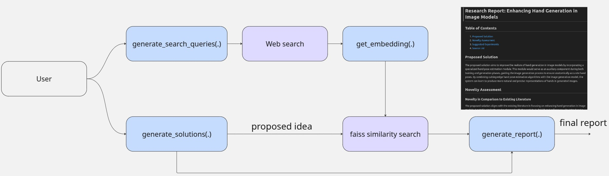

## Features
- **Query Generation**: Automatically formulates relevant search queries from your problem statement.
- **Literature Retrieval**: Searches and parses abstracts from academic literature related to the topic.
- **Idea Generation**: Proposes new research ideas.
- **Novelty Assessment**: Compares generated ideas against retrieved literature to assess originality using similarity search with Faiss (Facebook AI Similarity Search) .
- **Report Generation**: Produces a structured summary report that includes:
  - Proposed research ideas
  - Novelty 
  - Suggested experiments for validation


## Setup instructions


### 1. Create a virtual environment

Run this in the project directory:
```bash
python -m venv <venv>
```

### 3. Activate the virtual environment

**On Linux/Mac:**
```bash
source venv/bin/activate
```

**On Windows:**
```bash
venv\Scripts\activate
```

### 4. Install dependencies

Install the reuired packages in `requirements.txt`:
```bash
pip install -r requirements.txt
```
### 5. Set API key as an environment variable
Create a `.env` file in the root directory with your API key secrets:
```
OPENAI_API_KEY=your-api-key-here
```
See [Open AI](https://platform.openai.com/api-keys) for how to create keys.

## Usage

Run the assistant:
```bash
python src/main.py
```

You'll be prompted to enter a technical problem description. Example:
```
Current image generation models often struggle with accurately generating hands. How could I go about improving these models to fix this?
```

The assistant will respond with relevant research directions, novelty checks, and experiment suggestions.

## Future improvements
1. **Improve literature retrieval**  
   Currently, the package retrieves information from paper abstracts. A more advanced approach would involve implementing a RAG to extract richer, context-aware information directly from full-text literature.

2. **LLM function calling and agentic behavior**  
   Introduce more dynamic agent capabilities using LLM function calling, such as:
   - Autonomous re-searching until a specified compute or token budget is met.
   - Retrospective analysis where the agent reviews its own trace, identifies gaps in retrieved knowledge, and generates additional, targeted queries to address those gaps.
